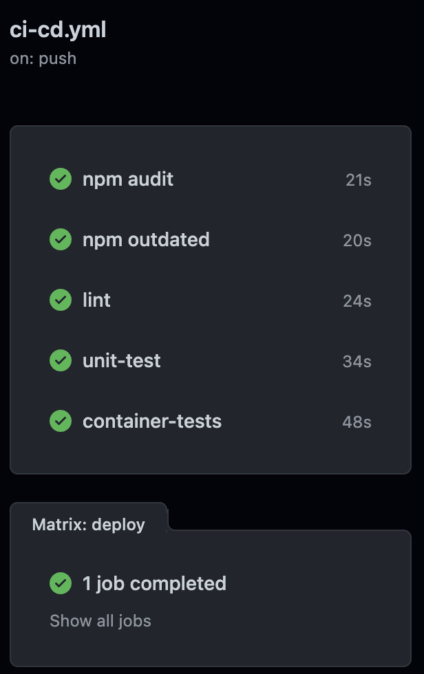
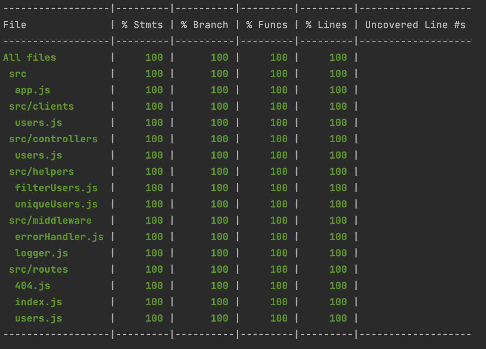

#DWP Code Test

This NodeJS application is a microservice which is created for the DWP code test. It has one endpoint `/users`.
When called, the app will call two endpoints from the test api to retrieve lists of users that either live in london,
or a full list of users that are filtered by longitude and latitude to find those near london. A unique list is then returned.

The app includes basic logging, error handling, and a CI/CD pipeline which builds the container and pushes to heroku

The app was built using bdd and tdd, with 100% test coverage.

The deployed app can be found at [https://dwp-code-test.herokuapp.com](https://dwp-code-test.herokuapp.com)

A description of the endpoint can be found at [https://dwp-code-test.herokuapp.com/swagger](https://dwp-code-test.herokuapp.com/swagger)
